# 読書管理SNS ER 図

[要件定義.md](要件定義.md) および [技術スタック.md](技術スタック.md) に基づき、論理 ER 図を Mermaid で記述します。VS Code の Markdown プレビュー（Mermaid 対応拡張）または GitHub 上で図として表示されます。

---

## 1. 全体 ER 図

```mermaid
erDiagram
    User ||--o{ Post : "writes"
    User ||--o{ Comment : "writes"
    User ||--o{ Like : "gives"
    User ||--o{ Repost : "performs"
    User ||--o{ Follow : "as_follower"
    User ||--o{ Follow : "as_followee"
    User ||--o{ Block : "as_blocker"
    User ||--o{ Block : "as_blocked"
    User ||--o{ Mute : "as_muter"
    User ||--o{ Mute : "as_muted"
    User ||--o{ UserGenre : "selects"
    User ||--o{ UserFavoriteBook : "favorites"
    User ||--o{ Notification : "as_recipient"
    User ||--o{ Notification : "as_actor"
    User ||--o{ SearchHistory : "searches"
    User ||--o{ Device : "owns"

    Genre ||--o{ UserGenre : "selected_by"
    Book  ||--o{ UserFavoriteBook : "favorited_by"
    Book  ||--o{ Post : "referenced_in"

    Post  ||--o{ Comment : "has"
    Post  ||--o{ Repost  : "reposted_in"
    Post  ||--o{ PostHashtag : "tagged_with"
    Hashtag ||--o{ PostHashtag : "applied_to"

    User {
      bigint    id PK
      string    email UK
      string    encrypted_password
      string    handle UK
      string    display_name
      string    avatar_url
      text      bio
      boolean   is_private
      integer   reading_goal
      datetime  created_at
      datetime  updated_at
    }

    Genre {
      bigint id PK
      string name UK
    }

    Book {
      bigint id PK
      string title
      string author
      string isbn UK
      string cover_url
      date   published_on
      datetime created_at
      datetime updated_at
    }

    Post {
      bigint   id PK
      bigint   user_id FK
      bigint   book_id FK "nullable"
      text     body
      tsvector body_tsv "全文検索用"
      datetime created_at
      datetime updated_at
      datetime deleted_at "nullable"
    }

    Comment {
      bigint   id PK
      bigint   post_id FK
      bigint   user_id FK
      text     body
      datetime created_at
      datetime updated_at
      datetime deleted_at "nullable"
    }

    Like {
      bigint   id PK
      bigint   user_id FK
      string   target_type "POST/BOOK/COMMENT"
      bigint   target_id
      datetime created_at
    }

    Follow {
      bigint   id PK
      bigint   follower_id FK
      bigint   followee_id FK
      string   status "PENDING/ACCEPTED"
      datetime created_at
      datetime updated_at
    }

    Block {
      bigint   id PK
      bigint   blocker_id FK
      bigint   blocked_id FK
      datetime created_at
    }

    Mute {
      bigint   id PK
      bigint   muter_id FK
      bigint   muted_id FK
      datetime created_at
    }

    Repost {
      bigint   id PK
      bigint   user_id FK
      bigint   post_id FK
      string   type "SIMPLE/QUOTE"
      text     comment "QUOTE の場合のみ"
      datetime created_at
    }

    Hashtag {
      bigint id PK
      string name UK
    }

    PostHashtag {
      bigint id PK
      bigint post_id FK
      bigint hashtag_id FK
    }

    UserGenre {
      bigint id PK
      bigint user_id FK
      bigint genre_id FK
    }

    UserFavoriteBook {
      bigint  id PK
      bigint  user_id FK
      bigint  book_id FK
      integer position "並び順"
    }

    Notification {
      bigint   id PK
      bigint   recipient_id FK
      bigint   actor_id FK
      string   type "LIKE/FOLLOW/FOLLOW_REQUEST/REPOST/COMMENT 等"
      string   target_type "POST/COMMENT/USER 等"
      bigint   target_id
      datetime read_at "nullable"
      datetime created_at
    }

    SearchHistory {
      bigint   id PK
      bigint   user_id FK
      string   query
      string   category "user/book/post/tag/all"
      datetime executed_at
    }

    Device {
      bigint   id PK
      bigint   user_id FK
      string   platform "ios/android/web"
      string   token
      datetime created_at
      datetime updated_at
    }
```



---

## 2. テーブル設計詳細

### 2.1 User

| カラム | 型 | 制約 | 説明 |
|---|---|---|---|
| id | bigint | PK | 主キー |
| email | citext | UNIQUE NOT NULL | ログイン用メールアドレス |
| encrypted_password | string | NOT NULL | Devise 暗号化済みパスワード |
| handle | string | UNIQUE NOT NULL | @ハンドル（3〜20 半角英数_） |
| display_name | string | NOT NULL | 表示名（1〜50） |
| avatar_url | string | | アイコン URL（Active Storage 経由） |
| bio | text | | 自己紹介（〜200） |
| is_private | boolean | NOT NULL DEFAULT false | 非公開アカウントフラグ |
| reading_goal | integer | | 読書目標冊数（年間など） |
| reset_password_token | string | UNIQUE | Devise |
| jti | string | NOT NULL | devise-jwt 用 |
| created_at / updated_at | datetime | NOT NULL | |

**インデックス**: `email` UNIQUE, `handle` UNIQUE, `jti` UNIQUE

---

### 2.2 Book

| カラム | 型 | 制約 | 説明 |
|---|---|---|---|
| id | bigint | PK | |
| title | string | NOT NULL | |
| author | string | | |
| isbn | string | UNIQUE | ISBN-10 / 13 |
| cover_url | string | | |
| published_on | date | | |
| created_at / updated_at | datetime | NOT NULL | |

**インデックス**: `isbn` UNIQUE, `title` GIN(`pg_trgm`), `author` GIN(`pg_trgm`)

---

### 2.3 Post

| カラム | 型 | 制約 | 説明 |
|---|---|---|---|
| id | bigint | PK | |
| user_id | bigint | FK NOT NULL | 投稿者 |
| book_id | bigint | FK NULL | 紐づく本（任意） |
| body | text | NOT NULL | 投稿本文 |
| body_tsv | tsvector | | 全文検索インデックス用（pg_search） |
| created_at / updated_at | datetime | NOT NULL | |
| deleted_at | datetime | | 論理削除 |

**インデックス**: `user_id`, `book_id`, `(deleted_at IS NULL, created_at DESC)`, `body_tsv` GIN

---

### 2.4 Comment

| カラム | 型 | 制約 | 説明 |
|---|---|---|---|
| id | bigint | PK | |
| post_id | bigint | FK NOT NULL | 親投稿 |
| user_id | bigint | FK NOT NULL | コメント主 |
| body | text | NOT NULL | |
| created_at / updated_at | datetime | NOT NULL | |
| deleted_at | datetime | | 論理削除 |

**インデックス**: `(post_id, created_at)`, `user_id`

---

### 2.5 Like （ポリモーフィック）

| カラム | 型 | 制約 | 説明 |
|---|---|---|---|
| id | bigint | PK | |
| user_id | bigint | FK NOT NULL | |
| target_type | string | NOT NULL | `Post` / `Book` / `Comment` |
| target_id | bigint | NOT NULL | |
| created_at | datetime | NOT NULL | |

**インデックス**:
- UNIQUE `(user_id, target_type, target_id)` ← LK-03 同一ユーザー × 同一対象は最大 1 件
- `(target_type, target_id)` ← 件数集計用

---

### 2.6 Follow

| カラム | 型 | 制約 | 説明 |
|---|---|---|---|
| id | bigint | PK | |
| follower_id | bigint | FK NOT NULL | フォローする側 |
| followee_id | bigint | FK NOT NULL | フォローされる側 |
| status | string | NOT NULL | `PENDING` / `ACCEPTED` |
| created_at / updated_at | datetime | NOT NULL | |

**インデックス**:
- UNIQUE `(follower_id, followee_id)` ← FL-05 重複防止
- `(followee_id, status)` ← フォロワー一覧
- `(follower_id, status)` ← フォロイー一覧
- CHECK 制約: `follower_id <> followee_id`

---

### 2.7 Block

| カラム | 型 | 制約 | 説明 |
|---|---|---|---|
| id | bigint | PK | |
| blocker_id | bigint | FK NOT NULL | |
| blocked_id | bigint | FK NOT NULL | |
| created_at | datetime | NOT NULL | |

**インデックス**: UNIQUE `(blocker_id, blocked_id)`、`blocked_id` 単独インデックスも追加（被ブロック側からのフィルタ用）

---

### 2.8 Mute

| カラム | 型 | 制約 | 説明 |
|---|---|---|---|
| id | bigint | PK | |
| muter_id | bigint | FK NOT NULL | |
| muted_id | bigint | FK NOT NULL | |
| created_at | datetime | NOT NULL | |

**インデックス**: UNIQUE `(muter_id, muted_id)`、`muter_id` ← タイムラインフィルタ用

---

### 2.9 Repost

| カラム | 型 | 制約 | 説明 |
|---|---|---|---|
| id | bigint | PK | |
| user_id | bigint | FK NOT NULL | リポスト主 |
| post_id | bigint | FK NOT NULL | 元投稿 |
| type | string | NOT NULL | `SIMPLE` / `QUOTE` |
| comment | text | | QUOTE 時のみ |
| created_at | datetime | NOT NULL | |

**インデックス**:
- 部分 UNIQUE `(user_id, post_id) WHERE type='SIMPLE'` ← RP-03 単純リポストはトグル
- `(post_id, created_at DESC)` ← リポスト一覧
- `(user_id, created_at DESC)` ← マイリポスト

---

### 2.10 Hashtag / PostHashtag

#### Hashtag

| カラム | 型 | 制約 |
|---|---|---|
| id | bigint | PK |
| name | string | UNIQUE NOT NULL |

#### PostHashtag

| カラム | 型 | 制約 |
|---|---|---|
| id | bigint | PK |
| post_id | bigint | FK NOT NULL |
| hashtag_id | bigint | FK NOT NULL |

**インデックス**: UNIQUE `(post_id, hashtag_id)`、`hashtag_id`

---

### 2.11 Genre / UserGenre / UserFavoriteBook

#### Genre

| カラム | 型 | 制約 |
|---|---|---|
| id | bigint | PK |
| name | string | UNIQUE NOT NULL |

#### UserGenre

| カラム | 型 | 制約 |
|---|---|---|
| id | bigint | PK |
| user_id | bigint | FK NOT NULL |
| genre_id | bigint | FK NOT NULL |

**インデックス**: UNIQUE `(user_id, genre_id)`

#### UserFavoriteBook

| カラム | 型 | 制約 |
|---|---|---|
| id | bigint | PK |
| user_id | bigint | FK NOT NULL |
| book_id | bigint | FK NOT NULL |
| position | integer | NOT NULL DEFAULT 0 |

**インデックス**: UNIQUE `(user_id, book_id)`、`(user_id, position)`

---

### 2.12 Notification

| カラム | 型 | 制約 | 説明 |
|---|---|---|---|
| id | bigint | PK | |
| recipient_id | bigint | FK NOT NULL | 受信者 |
| actor_id | bigint | FK NOT NULL | 行為者（自分自身宛は作らない） |
| type | string | NOT NULL | `LIKE_POST`, `LIKE_COMMENT`, `FOLLOW`, `FOLLOW_REQUEST`, `FOLLOW_ACCEPTED`, `REPOST`, `QUOTE_REPOST`, `COMMENT` 等 |
| target_type | string | | 対象種別 |
| target_id | bigint | | 対象 ID |
| read_at | datetime | NULL | 既読時刻 |
| created_at | datetime | NOT NULL | |

**インデックス**: `(recipient_id, created_at DESC)`、`(recipient_id, read_at)`

---

### 2.13 SearchHistory

| カラム | 型 | 制約 | 説明 |
|---|---|---|---|
| id | bigint | PK | |
| user_id | bigint | FK NOT NULL | |
| query | string | NOT NULL | |
| category | string | | `user`/`book`/`post`/`tag`/`all` |
| executed_at | datetime | NOT NULL | |

**インデックス**: `(user_id, executed_at DESC)`

---

### 2.14 Device

| カラム | 型 | 制約 | 説明 |
|---|---|---|---|
| id | bigint | PK | |
| user_id | bigint | FK NOT NULL | |
| platform | string | NOT NULL | `ios`/`android`/`web` |
| token | string | NOT NULL | FCM / Web Push エンドポイント |
| created_at / updated_at | datetime | NOT NULL | |

**インデックス**: UNIQUE `(platform, token)`、`user_id`

---

## 3. リレーション設計の補足

### 3.1 自己参照（User ⇄ User）

`Follow`, `Block`, `Mute` は同じ `User` テーブルを 2 度参照する自己参照リレーション。Rails 上は以下のように定義する想定。

```ruby
class User < ApplicationRecord
  has_many :active_follows,  class_name: 'Follow', foreign_key: :follower_id
  has_many :passive_follows, class_name: 'Follow', foreign_key: :followee_id
  has_many :followees, through: :active_follows,  source: :followee
  has_many :followers, through: :passive_follows, source: :follower

  has_many :active_blocks,  class_name: 'Block', foreign_key: :blocker_id
  has_many :passive_blocks, class_name: 'Block', foreign_key: :blocked_id

  has_many :mutes_as_muter, class_name: 'Mute',  foreign_key: :muter_id
end
```

### 3.2 ポリモーフィック（Like）

Like の対象は `Post` / `Book` / `Comment` の 3 種類なのでポリモーフィック関連を採用。

```ruby
class Like < ApplicationRecord
  belongs_to :user
  belongs_to :target, polymorphic: true
end
```

通知は `Book` 対象のいいねでは作らない（要件 LK-N-05）。

### 3.3 ハイブリッドフォロー（公開／非公開）

- 公開アカウントへのフォローは `Follow.status = 'ACCEPTED'` で即時作成
- 非公開アカウントへのフォローは `Follow.status = 'PENDING'`、承認時に `'ACCEPTED'` へ更新（FL-01 / FL-02）
- ステータスは Rails の enum で表現

---

## 4. 集計戦略（カウンタ）

要件 LK-07（いいね件数キャッシュ）、RP-04（リポスト件数）に対応するため、以下を選択肢として検討:

| 方式 | 内容 | メリット / デメリット |
|---|---|---|
| **都度集計**（`COUNT(*)`） | クエリ毎にカウント | 単純。中規模までは十分 |
| **counter_cache カラム** | 親に `likes_count` 等を持たせ Rails が更新 | 高速。一貫性は最終的整合 |
| **集計テーブル** | `LikeAggregate(target, count)` を別途管理し、Sidekiq で非同期更新 | スケーラビリティ高。実装コストやや高 |

**推奨**: MVP では都度集計または `counter_cache`。スケール時に集計テーブルに移行。

---

## 5. データ整合性ルール

| 要件 ID | 実装ポイント |
|---|---|
| LK-03 | `Like` に UNIQUE `(user_id, target_type, target_id)` |
| LK-08 | サービス層で Block 関係をチェック、既存 Like は Block 成立時に Sidekiq で削除（`BlockCleanupWorker`） |
| FL-05 | DB CHECK `follower_id <> followee_id` + アプリ層で二重防御 |
| BL-02 | Block 成立時に Sidekiq で双方向 Follow を削除 |
| RP-03 | Repost(`SIMPLE`) に部分 UNIQUE インデックス |
| RP-08 | サービス層で `target.user.is_private` を検証 |
| 削除済み投稿の扱い | `deleted_at` 列で論理削除、関連 SELECT は `WHERE deleted_at IS NULL` |

---

## 6. マイグレーション順序（推奨）

1. `users`（Devise）
2. `genres`, `books`
3. `user_genres`, `user_favorite_books`
4. `posts`（`book_id` FK）
5. `comments`
6. `likes`
7. `follows`, `blocks`, `mutes`
8. `hashtags`, `post_hashtags`
9. `reposts`
10. `notifications`
11. `search_histories`
12. `devices`

---

## 7. 今後の拡張余地

- **読了管理**: `ReadingStatus(user_id, book_id, status, started_at, finished_at, rating)` を追加
- **コレクション（本棚）**: `Bookshelf(user_id, name, is_public)` + `BookshelfBook`
- **DM**: `Conversation`, `Message`
- **通報**: `Report(reporter_id, target_type, target_id, reason)`
