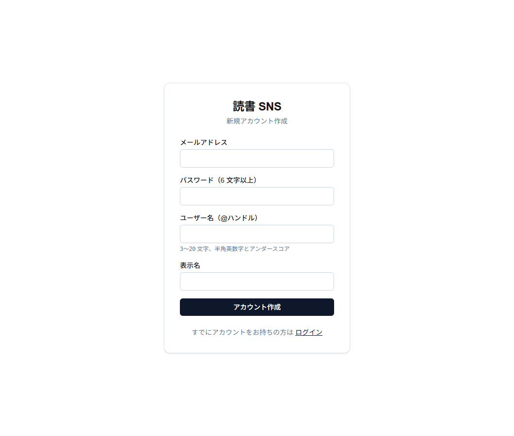
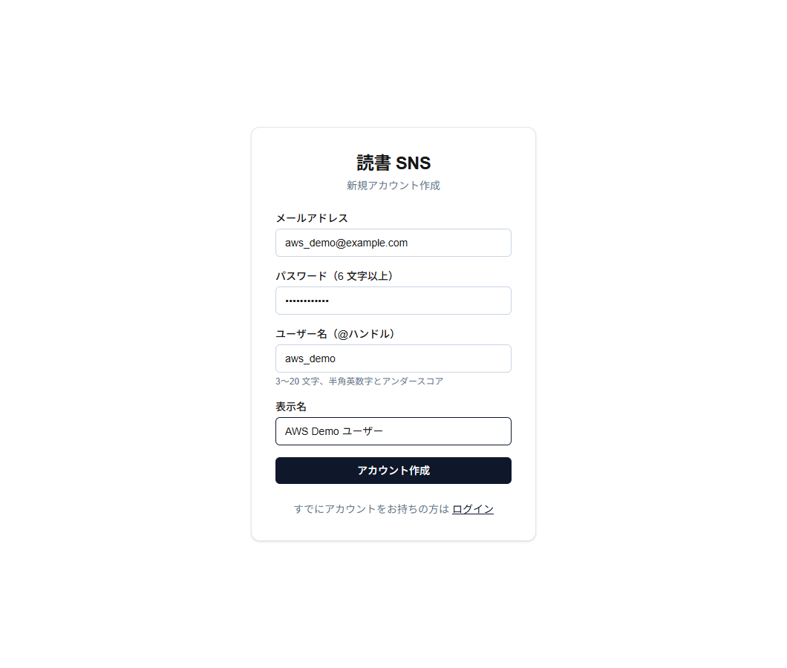
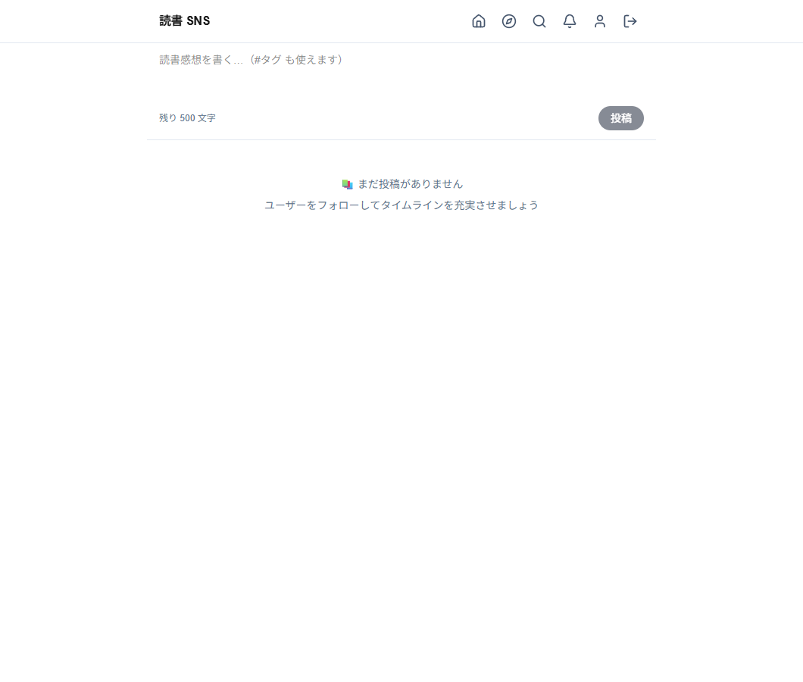
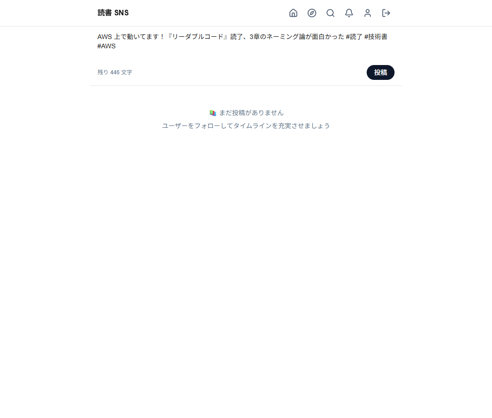
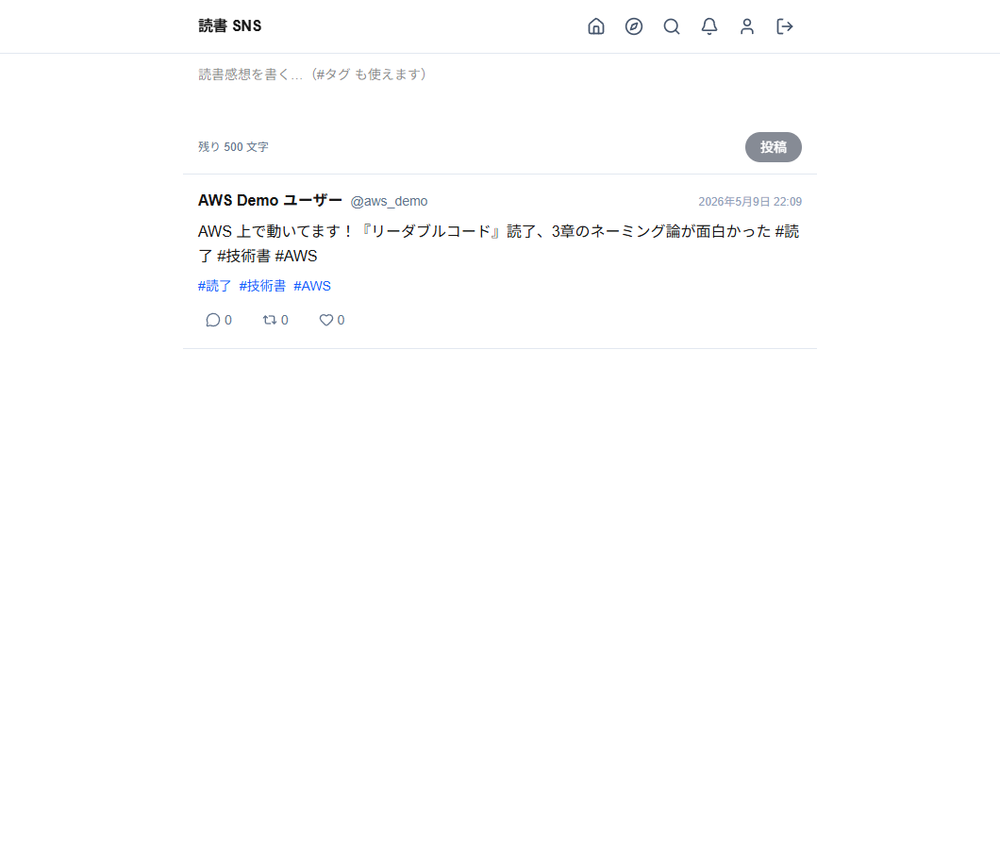
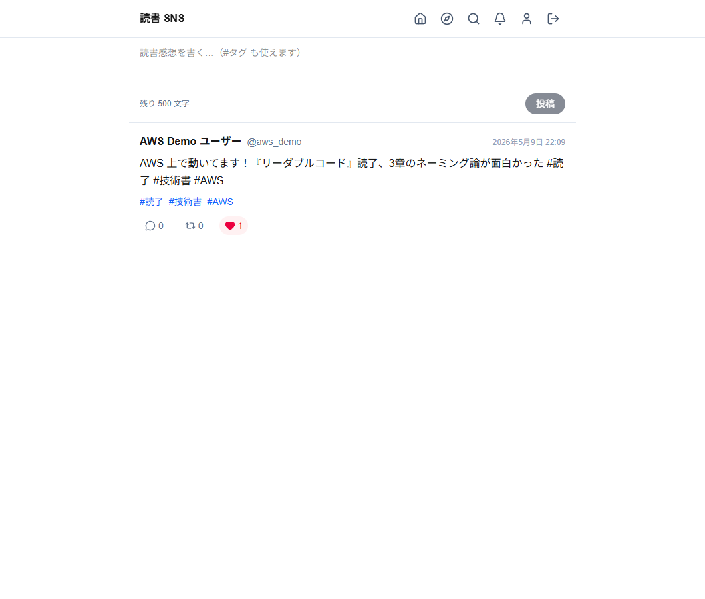
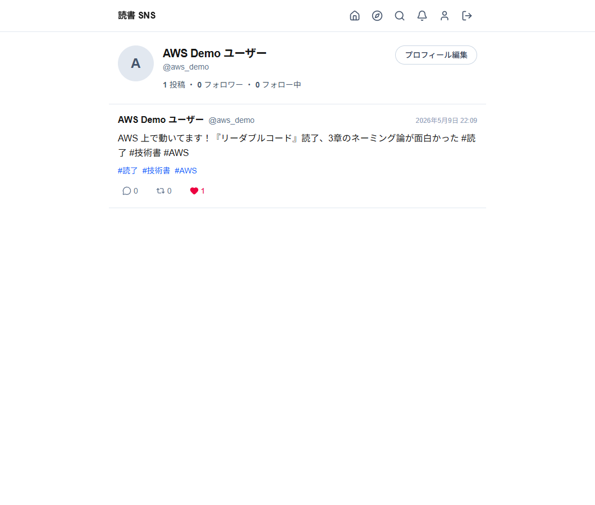
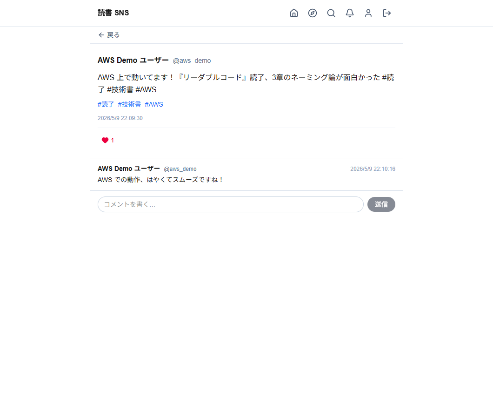
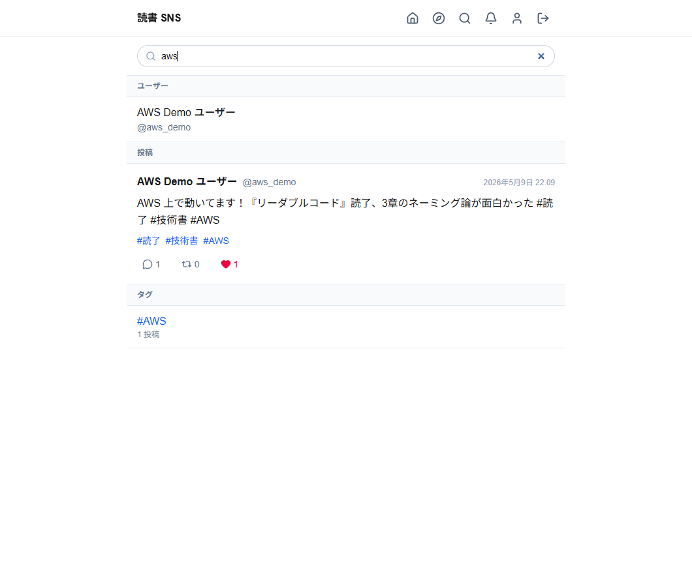

# 読書管理 SNS

読書記録を共有するソーシャルネットワーキングアプリケーション。

## 🌐 ライブデモ

**👉 [http://readingbook-sns-dev-alb-130523896.ap-northeast-1.elb.amazonaws.com](http://readingbook-sns-dev-alb-130523896.ap-northeast-1.elb.amazonaws.com)**

AWS（ECS Fargate / RDS PostgreSQL / ElastiCache Redis / ALB）で稼働する dev 環境です。
新規アカウントを作成して投稿・いいね・フォロー・検索などの機能を実際に試せます。

> ⚠️ 最小構成（HTTP のみ・ALB DNS 直結・~$60/月）で運用しているため、HTTPS / 独自ドメイン /
> 高可用化は未対応です。クラウド料金抑制のため予告なく停止する可能性があります。

## デモ画面（AWS 環境のスクリーンショット）

ローカル Docker / AWS ECS Fargate の両方で動作します。以下は AWS にデプロイした
本番環境（ALB 直結、HTTP）でのスクリーンショットです。

### 1. アカウント作成

新規ユーザーは `/signup` から登録します。メール / パスワード / @ハンドル / 表示名のシンプルな 4 項目。



入力後の状態：



### 2. ログイン後のホームタイムライン（空状態）

サインアップ後は自動的に JWT を発行し `/home` へ遷移。フォロー中ユーザーが居ない初期状態は
案内文付きの空状態が表示されます。



### 3. 投稿コンポーザ

`#タグ` を本文中に書くと自動でハッシュタグとして抽出・関連付けされます。残り文字数も表示。



### 4. 投稿後のタイムライン

投稿は即座にタイムライン先頭に追加され、本文中の `#読了` `#技術書` `#AWS` がリンクとして
ハイライトされます。



### 5. いいね（楽観的 UI）

ハートアイコンクリックで即時赤化、サーバ応答でカウントが確定。



### 6. ユーザープロフィール

`/users/:handle` で投稿数 / フォロワー / フォロー中、自分の投稿一覧を確認できます。
自分のプロフィールには「プロフィール編集」リンクが表示されます。



### 7. 投稿詳細 + コメント

投稿カードのコメントアイコンから詳細ページへ。下部の sticky 入力欄でコメント投稿できます。



### 8. 横断検索

`/search` でユーザー / 本 / 投稿 / タグを 1 リクエストで横断検索。



実際に試してみたい方は冒頭の **[ライブデモ](#-ライブデモ)** からどうぞ。

## 機能

- 投稿（読書感想・レビュー）
- いいね（投稿・本・コメント）
- フォロー（公開アカウント=即時 / 非公開アカウント=リクエスト型）
- リポスト（単純 / 引用）
- 検索（ユーザー / 本 / 投稿 / タグ）
- プロフィール設定（公開・非公開切替、好きなジャンル、お気に入りの本など）
- 通知（プッシュ通知 + アプリ内通知）

## 技術スタック

| レイヤー | 技術 |
|---|---|
| フロントエンド | Next.js (App Router) + TypeScript + Tailwind CSS |
| バックエンド | Ruby on Rails (API) + PostgreSQL |
| 認証 | Devise + JWT |
| 検索 | PostgreSQL 全文検索（pg_search） |
| ジョブキュー | Sidekiq + Redis |
| ストレージ | Active Storage（本番 S3 / 開発 MinIO） |
| インフラ | Docker / AWS（本番） |

詳細は [技術スタック.md](技術スタック.md) を参照。

## ドキュメント

| ドキュメント | 内容 |
|---|---|
| [要件定義.md](要件定義.md) | 機能要件・非機能要件 |
| [技術スタック.md](技術スタック.md) | 採用技術と構成 |
| [ER図.md](ER図.md) | データモデル |
| [API設計.md](API設計.md) | REST API 仕様 |
| [画面遷移図.md](画面遷移図.md) | 画面遷移 |
| [ワイヤーフレーム.md](ワイヤーフレーム.md) | 画面ワイヤーフレーム |
| [環境構築.md](環境構築.md) | ローカル開発環境セットアップ |

## クイックスタート

### 必要環境

- Docker Desktop（WSL2 バックエンド推奨）
- PowerShell 7+

### セットアップ

```powershell
# 1. .env を準備
Copy-Item .env.example .env

# 2. シークレット生成（環境構築.md の手順 3.4 参照）

# 3. ビルド & 起動
docker compose up -d
```

| サービス | URL |
|---|---|
| フロントエンド | http://localhost:3010 |
| バックエンド API | http://localhost:3001 |
| MinIO コンソール | http://localhost:9001 |

詳細手順は [環境構築.md](環境構築.md)。

## ブランチ運用

| ブランチ | 役割 |
|---|---|
| `main` | 本番ブランチ。本番デプロイ対象。develop からの PR でのみ更新する |
| `develop` | 開発統合ブランチ。**デフォルトブランチ**。フィーチャブランチからの PR を受け入れる |
| `feature/*` | 機能開発用ブランチ。develop から派生し、develop に PR を出す |
| `hotfix/*` | 本番緊急修正用。main から派生し、main と develop 両方にマージする |

### 典型フロー

```
feature/like-api ──► develop ──► main
                       ▲
hotfix/critical-bug ───┴──────► main
```

CI は `main` と `develop` への push / PR で起動します。

## ライセンス

未定（個人プロジェクト）
