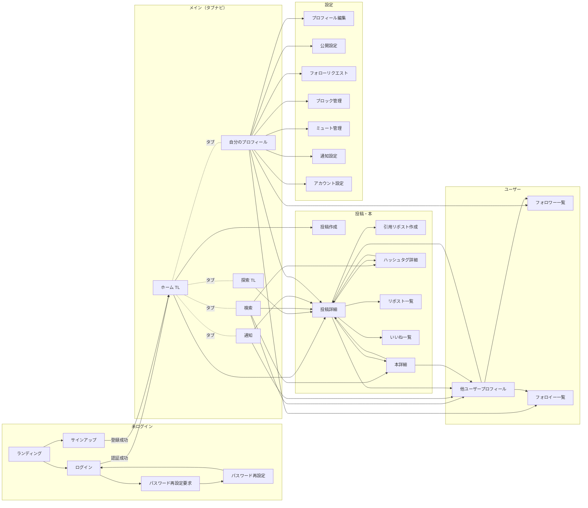
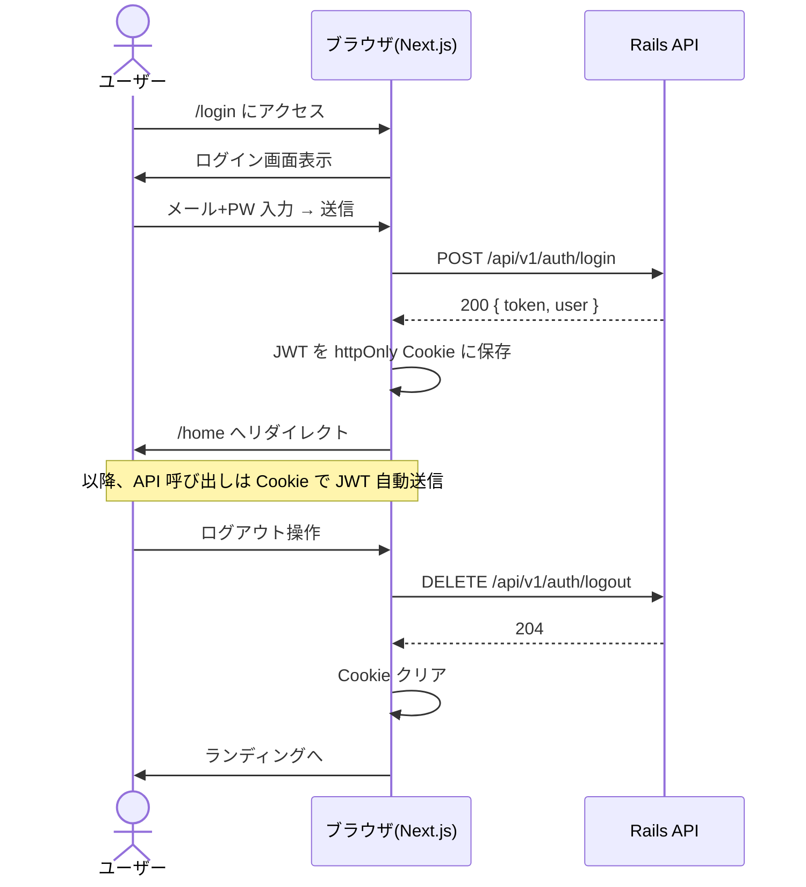
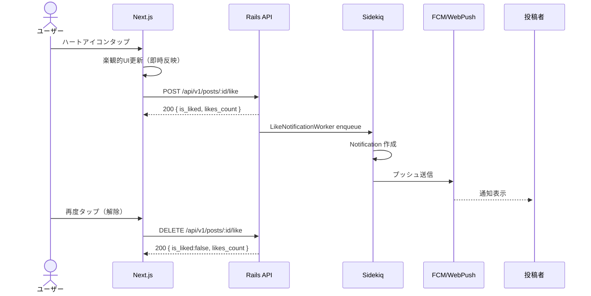
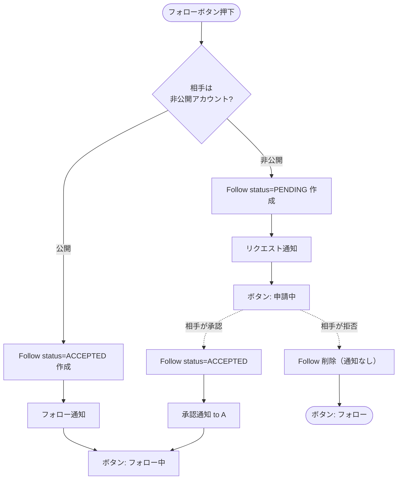
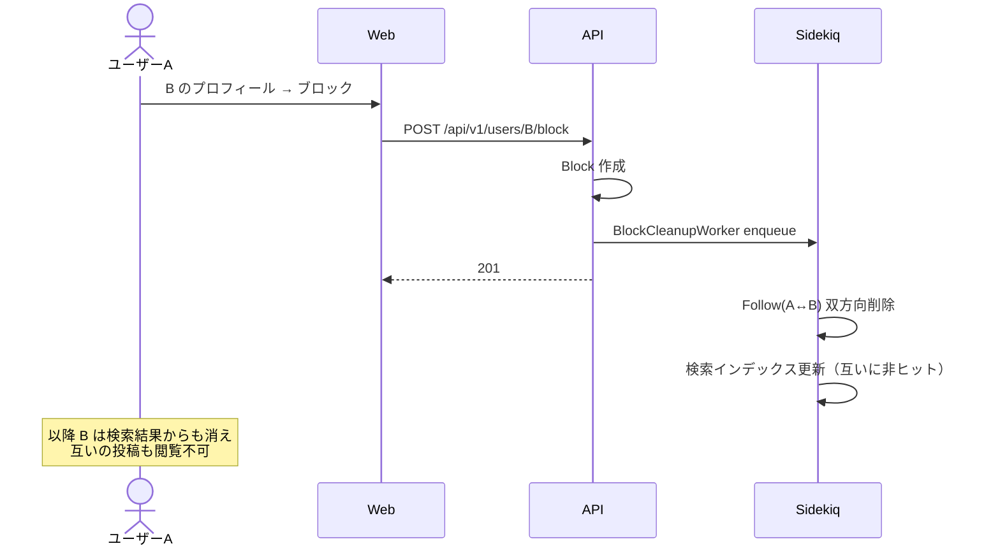

# 読書管理SNS 画面遷移図

[要件定義.md](要件定義.md) ／ [API設計.md](API設計.md) に基づく画面遷移図です。Mermaid フローチャートを VS Code の Markdown プレビュー（Mermaid 拡張）または GitHub 上で図として表示できます。

---

## 1. 画面一覧

### 1.1 未ログイン

| ID | 画面名 | パス（例） |
|---|---|---|
| L01 | ランディング | `/` |
| L02 | ログイン | `/login` |
| L03 | サインアップ | `/signup` |
| L04 | パスワード再設定要求 | `/password/forgot` |
| L05 | パスワード再設定 | `/password/reset?token=` |

### 1.2 ログイン後（メインナビ常時表示）

| ID | 画面名 | パス（例） |
|---|---|---|
| H01 | ホームタイムライン | `/home` |
| H02 | 探索タイムライン | `/explore` |
| S01 | 検索 | `/search` |
| N01 | 通知 | `/notifications` |
| P01 | 自分のプロフィール | `/users/:my_handle` |
| P02 | 他ユーザーのプロフィール | `/users/:handle` |
| P03 | フォロワー一覧 | `/users/:handle/followers` |
| P04 | フォロイー一覧 | `/users/:handle/following` |

### 1.3 投稿・本

| ID | 画面名 | パス（例） |
|---|---|---|
| C01 | 投稿作成（モーダル） | `(:from)/compose` |
| C02 | 引用リポスト作成（モーダル） | `(:from)/quote/:post_id` |
| D01 | 投稿詳細 | `/posts/:id` |
| D02 | 本詳細 | `/books/:id` |
| D03 | ハッシュタグ詳細 | `/hashtags/:name` |
| D04 | 投稿のリポスト一覧 | `/posts/:id/reposts` |
| D05 | 投稿のいいね一覧（投稿者のみ） | `/posts/:id/likes` |

### 1.4 設定・管理

| ID | 画面名 | パス（例） |
|---|---|---|
| E01 | プロフィール編集 | `/settings/profile` |
| E02 | 公開設定 | `/settings/privacy` |
| E03 | フォローリクエスト管理 | `/settings/follow_requests` |
| E04 | ブロック管理 | `/settings/blocks` |
| E05 | ミュート管理 | `/settings/mutes` |
| E06 | 通知設定 | `/settings/notifications` |
| E07 | アカウント設定（メール・パスワード） | `/settings/account` |

---

## 2. 全体遷移図



---

## 3. 認証フロー



---

## 4. いいね操作フロー



---

## 5. フォロー操作フロー（ハイブリッド）



---

## 6. リポスト操作フロー

```mermaid
flowchart TD
    Start([リポストボタン押下])
    Choice{選択}
    Simple[単純リポスト]
    Quote[引用リポスト画面へ]

    Start --> Choice
    Choice -->|そのまま拡散| Simple
    Choice -->|コメント付き| Quote

    Simple --> CheckSimple{既にリポスト済み?}
    CheckSimple -->|YES| Cancel[リポスト取消]
    CheckSimple -->|NO| Create[Repost(SIMPLE) 作成]
    Create --> Notify1[元投稿者へ通知]

    Quote --> Compose[引用リポスト作成画面]
    Compose --> CreateQuote[Repost(QUOTE) 作成]
    CreateQuote --> Notify2[元投稿者へ通知（コメント含む）]
```

---

## 7. ブロック → 関係クリーンアップ



---

## 8. ナビゲーション構造（モバイル）

```
┌─────────────────────────────┐
│      ヘッダー (任意)          │
├─────────────────────────────┤
│                             │
│         画面コンテンツ        │
│                             │
├─────────────────────────────┤
│ [Home][探索][検索][通知][自分]│  ← タブナビ
└─────────────────────────────┘
```

| タブ | 遷移先 |
|---|---|
| Home | H01 ホームタイムライン |
| 探索 | H02 探索タイムライン |
| 検索 | S01 検索 |
| 通知 | N01 通知（バッジで未読件数） |
| 自分 | P01 自分のプロフィール |

投稿作成は右下フローティングアクションボタン（FAB）から起動。

---

## 9. ナビゲーション構造（デスクトップ）

```
┌─────────┬────────────────────────────┬──────────────┐
│ サイド   │      タイムライン            │ サブカラム    │
│ ナビ     │                            │ (検索 / 関連) │
│         │                            │              │
│ Home    │                            │              │
│ 探索    │                            │              │
│ 検索    │                            │              │
│ 通知    │                            │              │
│ プロフ   │                            │              │
│ 設定    │                            │              │
│         │                            │              │
│ [投稿]   │                            │              │
└─────────┴────────────────────────────┴──────────────┘
```

3 カラム構成（Twitter/X 型）。サブカラムは画面によって役割が変わる:

- ホームTL: トレンド・おすすめユーザー
- 投稿詳細: 関連投稿・関連本
- プロフィール: 共通フォロワー・お気に入りの本

---

## 10. 主要 CTA（行動導線）

| シナリオ | 起点 | 操作 | 結果 |
|---|---|---|---|
| 新規投稿 | 任意画面の FAB / 投稿ボタン | C01 を開く → 投稿 | TL の先頭に追加 |
| 検索→ユーザーフォロー | S01 → P02 | フォローボタン | 公開ならACCEPTED、非公開ならPENDING |
| 通知から元投稿 | N01 通知タップ | D01 へ遷移 | 通知を既読化 |
| ハッシュタグ追跡 | D01 タグタップ | D03 へ | タグ付き投稿一覧 |
| 引用リポスト | D01 のリポストメニュー | C02 を開く → 投稿 | TLに引用Repost表示 |

---

## 11. エラー・空状態の遷移

| 状況 | 表示 | 遷移先 |
|---|---|---|
| 401 未認証 | トースト「再ログインしてください」 | L02 ログイン |
| 403 権限なし | 「この投稿は閲覧できません」 | 戻るボタン |
| 404 未存在 / ブロック中 | 「このページは見つかりません」 | 戻るボタン |
| 429 レート制限 | 「しばらく経ってから再試行」 | そのまま |
| TL 投稿ゼロ | 「フォローして TL を充実させましょう」 | S01 検索 |
| 通知ゼロ | 「まだ通知はありません」 | - |
